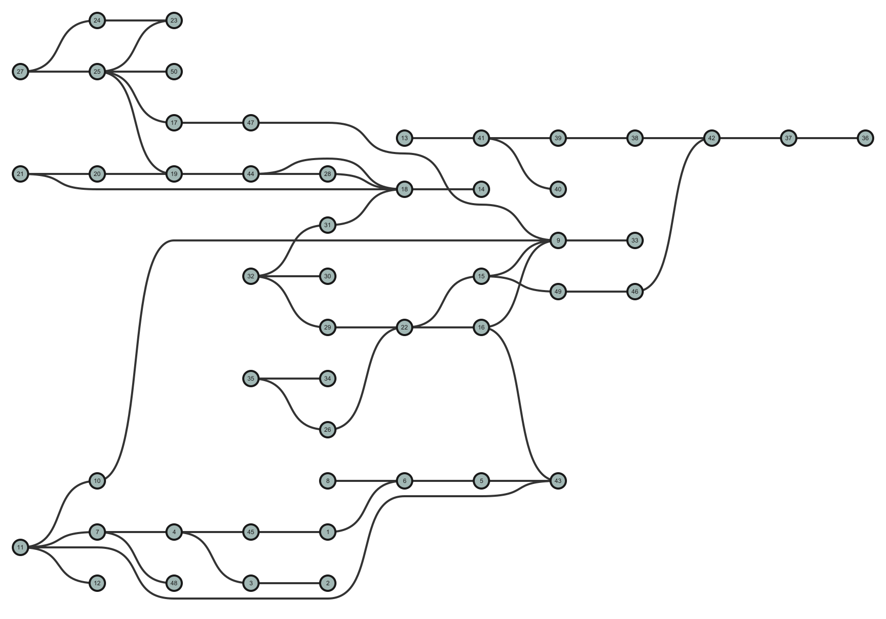

# The Scalable Layered Crossing Minimization Project

<div style="text-align:center">


This repository is written and maintained by [Connor Wilson](https://vis.khoury.northeastern.edu/people/Connor-Wilson/), who can be reached at [wilson.conn@northeastern.edu](mailto:wilson.conn@northeastern.edu).

It comprises research performed at Northeastern University's [Data Visualization Lab](https://vis.khoury.northeastern.edu) by [Connor Wilson](https://vis.khoury.northeastern.edu/people/Connor-Wilson/), [Eduardo Puerta](https://vis.khoury.northeastern.edu/people/Eduardo-Puerta/), [Tarik Crnovrsanin](https://www.tarikc.net), and [Sara Di Bartolomeo](https://vis.khoury.northeastern.edu/people/Sara-Di-Bartolomeo/), under the advising of [Cody Dunne](https://vis.khoury.northeastern.edu/people/Cody-Dunne/).
A free copy of our paper, *Faster integer linear programming formulations for optimal layered network visualization*, is avalable at [https://osf.io/5vq79]().
</div>

# Quickstart Guide
1. A Gurobi license is required to run this app. Visit [Gurobi for Academics and Researchers](https://www.gurobi.com/academia/academic-program-and-licenses/) for instructions on obtaining an individual academic license 
   1. The only requirement is to fill out an online form, processing typically takes no more than a few minutes.
2. Install the required packages
3. Run ```main.py``` to optimize an example Rome-Lib graph.

# Overview of class `LayeredOptimizer`
Defined in `src/optimization.py`, `LayeredOptimizer` reads as input a path to graph file or a `LayeredGraph` object.
Supported file types include `.graphml`, and text files containing an edge list where each line of the file is an edge `u, v` such that `u` and `v` are integer IDs for nodes.
Any path to a Rome-Lib, AT&T, or DAGmar graph included in this repo will also be read automatically.

E.g. `optimizer = LayeredOptimizer(path_to_file)`

Then, set the desired options for your `optimizer`:
1. Vertical position transitivity is default. To switch to direct transitivity, set `optimizer.direct_trans = True` and `optimizer.vertical_trans = False`.
2. Switches from our paper are set using the following options (note that all switches are off by default):
   1. Fix one variable is set using `optimizer.fix_one_var = True`
   2. Butterfly reduction is set using `optimizer.butterfly_reduction = True`
   3. Mirrored variables with symmetry constraints is set using `optimizer.mirror_vars = True`
   4. Heuristic starting assignments is set using `optimizer.heuristic_start = True`
   5. Aggressive presolve is set using `optimizer.aggro_presolve = True`
   6. Branching on x-vars is set using `optimizer.xvar_branch_priority = True`
   7. MIP relaxation is set using `optimizer.mip_relax = True`
3. Additional options that may be helpful are:
   1. `optimizer.cutoff_time` sets the amount of time (in seconds) the optimizer will run before terminating and returning its best found solution
   2. `optimizer.draw_graph` generates the image of the layout as an svg in the /Images folder. It is recommended to also set `optimizer.bendiness_reduction` and `optimizer.sequential_bendiness` for a prettier, edge-length minimized drawing.
      1. `optimizer.name` sets the name of the file
   3. `optimizer.verbose` prints more information about the visualization


Finally, optimize the graph using `optimizer.optimize_layout()`.

## Using predetermined layer assignments
By default, reading a graph by filepath does not read layer information from the file as well (unless the file is one of the provided DAGmar graphs, which are layered).
If the graph you'd like to optimize has predetermined layer assignments, you'll want to load it as a `LayeredGraph` object directly instead of providing a file path directly to the optimizer.
This can be done easily by importing `src/read_data.py` and calling

`g = read_data.read(path_to_file, layering=my_layering)`

where `my_layering` is a Python dictionary mapping node IDs to layer assignments.
`g` can then be passed to the optimizer, e.g.

`optimizer = LayeredOptimizer(g)`

# Other files of note in this repository

1. `src/graph.py` contains our custom layered graph class. A layered graph can be created manually by instantiating the object and using the following functions:
   1. `g.add_node(layer, name=your_custom_name)` adds a node at with layer `layer`. It is recommended to use integers for the names. An integer name will be used if unspecified.
   2. `g.add_edge(n1, n2)` adds an edge between nodes with names `n1`, `n2`.
   3. `g.add_anchors()` adds dummy nodes along long edges.
   4. `g.relayer()` is recommended after inserting dummy nodes. It cleans up the graph by removing empty layers, and optimizing a custom graph may error without it.
   
   The graph data can be accessed as follows:
   1. `g.nodes` is a list of the node objects. A node object `n` has ID `n.name`, layer `n.layer`, within-layer position `n.y` and dummy node identifier `n.is_anchor_node`.
   2. `g.edges` is the edge objects.
   3. `g.node_names` is a dictionary mapping node IDs to node objects.
   4. `g.layers` is a dictionary mapping layer IDs to the list of node objects in that layer.
2. `src/experiments.py` contains functions for all experiments run in our paper. Running this file performs every experiment in our paper (note: this takes an extraordinarily long time to complete, likely close to one month of computation).
3. `src/layering.py` contains functions performing the layer assignment step for graphs without predetermined layer assignments, using the algorithms described in our paper.